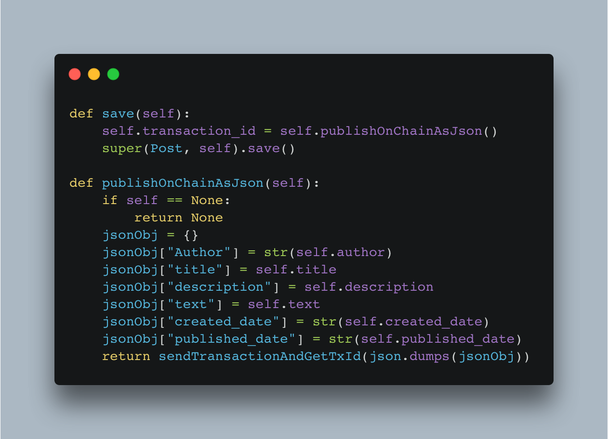
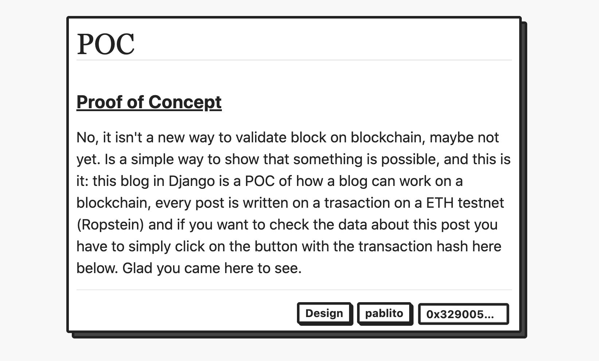
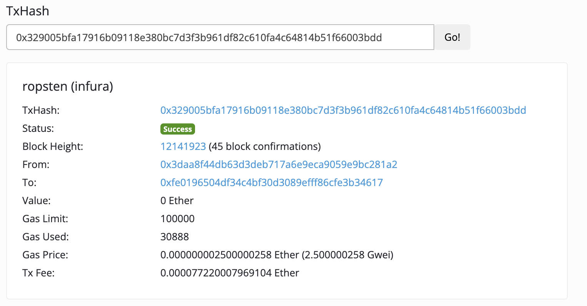

 

    DJango adn Web3 Blog Project

 

This project is a simple POC on how to create a stream of data and sotore it on a blockchain. 

The main pourpose of this project is to show how to combine Django, An Ethereum Testnet and Redis to make a powerfull tool to store valid information online. In this specific case the application is on a newspaper, to track the news based on the time them were published online, and to make them immutable once they are published

## 🚀&nbsp; How it's suppose to work?

As a simple blog, as many we use to know today. The only one difference is a simple function that is triggered when the user publish his post:

    

with this feature we can save the json of the post and hash it in the transaction, so it can be visible in every Blockchain transaction scanner of the used Blockchain.

    
    

## 🛠️&nbsp; How to install

TBD

## 📫&nbsp; Have a question? Want to chat? 

TBD

