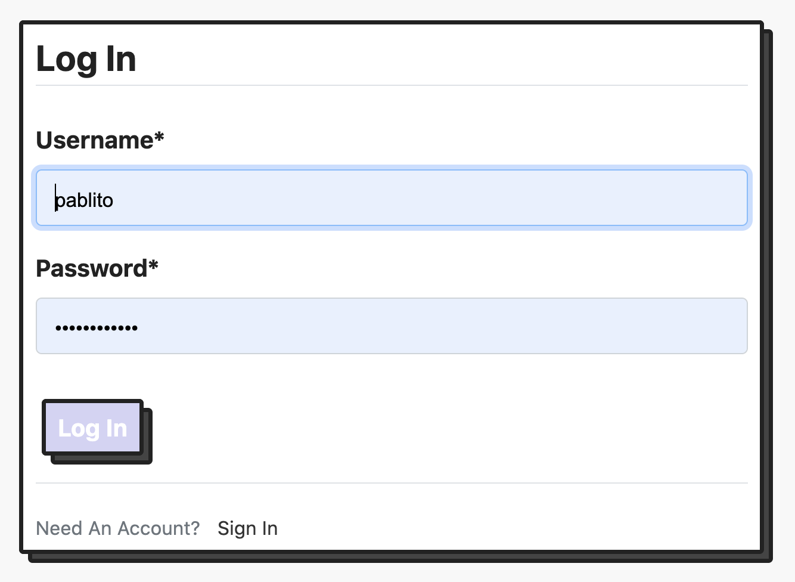
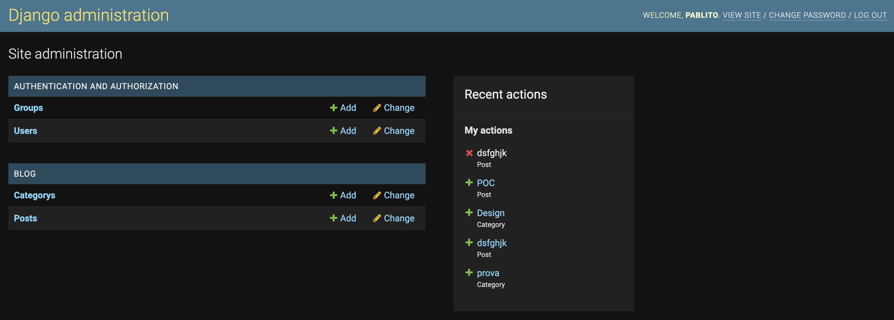

 
<h1 align="center">
    DJango and Web3 Blog Project
</h1>

 

This project is a simple <strong>POC</strong> on how to create a stream of data and sotore it on a blockchain. 

The main pourpose of this project is to show how to combine Django, An Ethereum Testnet and Redis to make a powerful tool to store valid information online. In this specific case the application is on a newspaper, to track the news based on the time them were published online, and to make them immutable once they are published

## 🚀&nbsp; How it's suppose to work?

As a simple blog, as many we use to know today. The only one difference is a simple function that is triggered when the user publish his post:

    

with this feature we can save the json of the post and hash it in the transaction, so it can be visible in every Blockchain transaction scanner of the used Blockchain.

    
    

The posts are obviously visibile by anyone but to write post you need to login, to have access to Django admin panel. Once logged is possible to reach admin panels going to '/admin' route.

    
    

## 🏴‍☠️&nbsp; Add ons

There a simple Redis implementation to check if the login ip address is always the same or not.

I implemented nested views to make thee frontend more uniform.

I used a '.env' file to store my super secret strings.

## 🛠️&nbsp; How to run

have Redis installed on machine.

- Clone the repo and install requirments.

- run the Venv.

- make database migrations.

- > `python manage.py runserver`.

- open `http://127.0.0.1:8000/` in browser

## 💭&nbsp; My thoughts

As a blockchain passionate is beautyful to work directly with transactions and blocks, and this project is the perfect first step. Really liked all the [Web3 Library](https://web3js.readthedocs.io/en/v1.7.1/).

## 📫&nbsp; Have a question? Want to chat? 

[LinkedIn](https://www.linkedin.com/in/pablo1255/)
@Pablomicheletti on Twitter and Instagram

